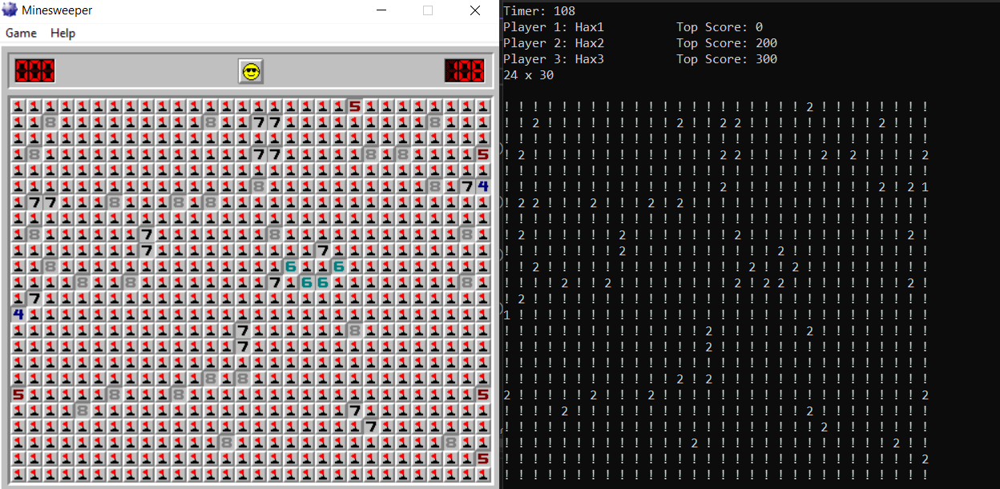
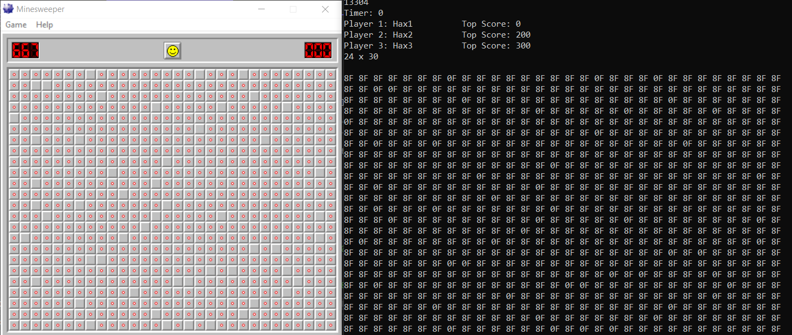

# Minesweeper-Trainer
Trainer for old WINMINE Minesweeper

## Usage
Run Minesweeper and MinesweeperTrainer -> Overlay will be drawn over the mines.

Link to minesweeper
[https://minesweepergame.com/download/windows-xp-minesweeper.php](https://minesweepergame.com/download/windows-xp-minesweeper.php)

## Idea
I made this to learn C++ and memory addresses and offsets.

## Screenshot

